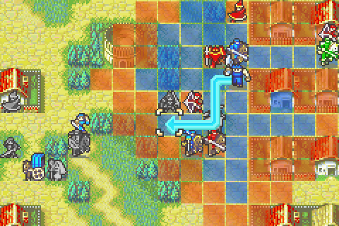

# Pathfinder for Lua using A* and BFS

This library provides two main functionalities:

- finding the optimal path from point A to B, and
- finding the distances from one point to the other points, useful to calculate movement/attack range like in the Fire Emblem series




## Examples

You generally have to provide 3 functions that defines the graph/map:

- `neighbors(node: Node) -> List<Node>`<br>
  Provide a list of neighbors of a node

- `weight(node: Node, neighbor: Node) -> Number`<br>
  Provide the cost/weight when moving from `node` to `neighbor`. If this is not set, then a default weight function will be used that always return 1.

- `heuristic(node: Node, dest: Node) -> Number`<br>
  Provide a rough estimation of how far away `node` is from `dest` to guide the searching process. Usually a straight distance function is used.


```lua
local Pathfinder = require 'pathfinder'

--
-- SETTING UP
--

local obstacles = {
	['.'] = 1,  -- grass
	['~'] = 4,  -- river
	['^'] = 20, -- mountain
}

local map = 
"...." ..
"~^.." ..
"~^.." ..
"~..."

local function neighbors(node)
	-- NOTE: You can use either this function or weight() to filter out inaccessible nodes

	-- nodes = {
	-- 	 1,  2,  3,  4,
	-- 	 5,  6,  7,  8,
	-- 	 9, 10, 11, 12,
	-- 	13, 14, 15, 16
	-- }

	local list = {}
	local up, down, left, right = node - 4, node + 4, node - 1, node + 1
	local row_min = math.floor((node - 1) / 4) * 4 + 1
	local row_max = row_min + 4

	if left >= row_min then table.insert(list, left) end
	if right < row_max then table.insert(list, right) end
	if up > 0 then table.insert(list, up) end
	if down / 4 <= 4 then table.insert(list, down) end

	return list
end

local function distance_squared(n1, n2)
	local x1, y1 = n1 % 4, n1 / 4
	local x2, y2 = n2 % 4, n2 / 4
	return (x2 - x1) * (x2 - x1) + (y2 - y1) * (y2 - y1)
end

local function weight(node, neighbor)
	local ob = map:sub(neighbor, neighbor)
	return obstacles[ob] or math.huge
end


--
-- ACTUAL USAGE
--


local path = Pathfinder.shortest_path{
	start = 1,
	dest = 14,
	neighbors = neighbors,
	weight = weight,
	heuristic = distance_squared,
}

-- -> { 2, 3, 7, 11, 15, 14 }

local distances = Pathfinder.weights_from_point{
	start = 1,
	neighbors = neighbors,
	weight = weight
}

-- ->
-- {
-- 	 0,  1, 2, 3
-- 	 4, 21, 3, 4
-- 	 8, 41, 4, 5
-- 	12, 42, 5, 6
-- }
```


## References

- `Pathfinder.shortest_path{start, dest, neighbors, weight, heuristic}`<br>
  Run an A* search to find the shortest path between `start` and `dest`.

- `Pathfinder.weights_from_point{start, neighbors, weight, max_weight}`<br>
  Run a simple breadth first search (BFS) to figure out the total cost from `start` to other destinations in its vicinity, limited by the optional `max_weight`.

## Note on `node`

This library uses nodes as table keys. Hence you have to be extra careful if your nodes are tables:
http://stackoverflow.com/questions/9201601/lua-how-to-look-up-in-a-table-where-the-keys-are-tables-or-objects

## License

https://mit-license.org/